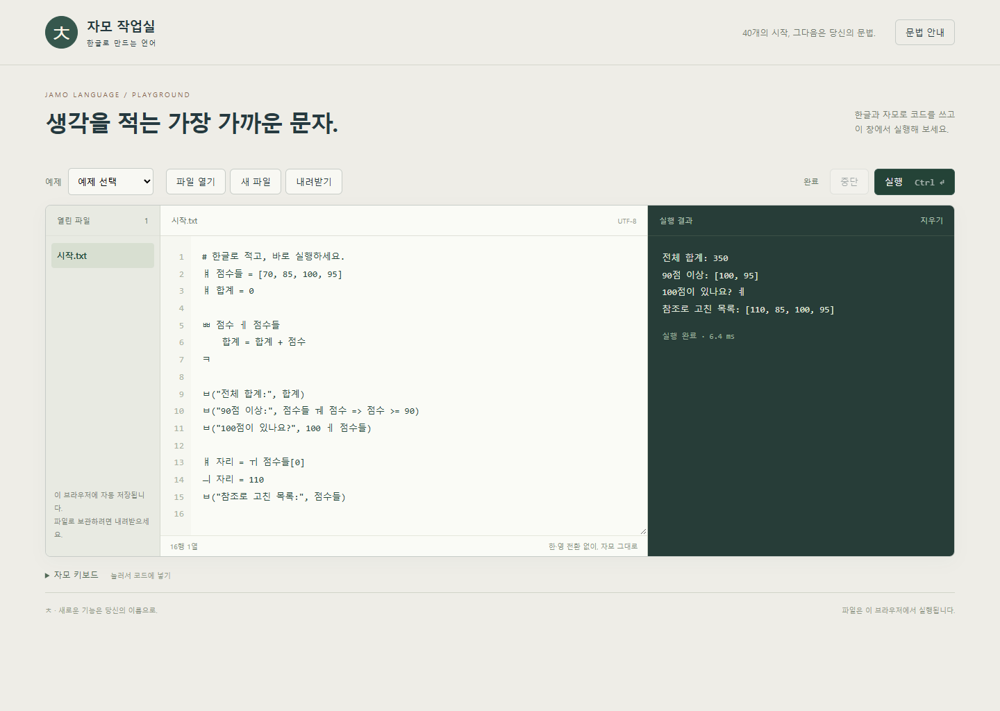

# JaMo — 자모 프로그래밍 언어

**현대 자모 40자로 키워드를 적고, 한글 이름과 익숙한 연산자로 프로그램을 씁니다.**

[브라우저에서 바로 실행하기](https://slyni7.github.io/JaMo/) · [GitHub 저장소](https://github.com/slyni7/JaMo)

`ㅁ`은 조건, `ㅃ`은 반복, `ㅂ`은 출력. `+ - * /`는 그대로 두고, 새 이름은 `ㅒ`로 소개합니다. 짧게 적는 자모 문법을 중심으로 영문·한글 별칭도 함께 제안합니다.

출발점은 **스마트폰에서 코드를 적을 때 한·영 전환과 입력 부담을 줄이고 싶다**는 개인적인 필요입니다. 작성자가 직접 쓰기 위한 언어를 먼저 만들고, 익숙한 단어로 시작하고 싶은 입문자에게도 같은 실행 환경을 여는 것을 목표로 합니다. 자모만으로 처음부터 모든 뜻을 알아볼 수 있다고 전제하지 않습니다.

> **현재 상태 — 실행 가능한 TypeScript 초안**  
> 자모·모아쓰기 문법과 `ㅊ`의 새 명령·자료형 정의를 구현했고, 브라우저와 Node CLI에서 검증합니다. *이탤릭체 별칭 목록*과 언어팩 화면은 제안 단계이며, 호스트 코드의 대응단어 등록은 지원합니다. GitHub Pages에 공개했고 기본 실행·모아쓰기·오류 표시·오류 후 재실행을 확인했습니다. 실제 휴대전화 입력은 아직 시험하지 않았습니다.

## 먼저 한 번 읽어보기

```text
ㅒ 점수들 = [70, 85, 100, 95]
ㅒ 합계 = 0

ㅃ 점수 ㅔ 점수들
    합계 = 합계 + 점수
ㅋ

ㅁ 합계 >= 300 ㄱ
    ㅂ("합계:", 합계)
ㅇ
    ㅂ("조금 더 모아 봅시다")
ㅋ

ㅂ("90점 이상:", 점수들 ㅞ 점수 => 점수 >= 90)
```

`ㅒ`로 변수를 선언하고, `ㅃ … ㅔ …`로 순회합니다. `ㅁ … ㄱ`은 조건을 검사하고 `ㅇ`은 다른 경우를 받습니다. 블록은 `ㅋ`으로 닫습니다. 마지막 줄의 `ㅞ`는 조건에 맞는 항목을 골라 새 목록으로 만듭니다.

이름을 붙인 이유도 문법의 일부입니다. `ㅒ`는 “얘를 소개합니다”, `ㅂ`은 “본 걸 내게도 보여다오”, `ㅓ·ㅕ`는 “어디? 여기!”, `ㅌ`은 “테이블·탁상·튜플”. `ㅡ`로 반복을 끊는 건 `ㅡㅡ`라고 우겨도 됩니다.

## 모아써도 같은 명령

`몍`, `몌ㄱ`, `ㅁㅖㄱ`은 모두 `ㅁ + ㅖ + ㄱ`, 즉 참인 조건문입니다.

```text
몍
    ㅂ("모아쓰기 실행")
ㅋ
```

**해석 우선순위는 대응단어 → 선언된 이름 → 기본 자모 해석입니다.** 등록된 대응단어를 먼저 적용하고, 변수·함수·`ㅊ`·매개변수·반복 변수·모듈 이름으로 선언된 표기를 보존합니다. 나머지 순한글 표기를 자모 명령으로 분해합니다. `ㅒ 몍 = 7`로 선언했다면 뒤의 `몍`은 그 이름입니다. 이름 표기는 소스의 선언 자리와 기존 실행 환경에서 먼저 수집하며, 실제 값의 생성·접근 범위·수명은 기존 실행 규칙을 따릅니다.

현대 완성형 음절과 현대 결합 자모, 부분 조합, 초성·중성 채움문자를 처리합니다. `ㅁᅟᅨᆨ` 같은 중성·종성 표기도 같은 명령으로 읽습니다. 실제 초성이 있는 `옉`은 `ㅇㅖㄱ`으로 분해합니다. 쌍자음과 복합 모음은 배정된 한 기호로 유지하고, 음절 속 겹받침은 구성 자음 순서로 풉니다.

낱자로 입력되거나 붙여넣어진 겹자모 `ㄳ ㄵ ㄶ ㄺ ㄻ ㄼ ㄽ ㄾ ㄿ ㅀ ㅄ` 11개도 같은 규칙을 따릅니다. `ㅄ`는 `ㅂㅅ`, `ㄳ`는 `ㄱㅅ`로 읽으며 초성·종성 위치를 요구하지 않습니다. 예를 들어 `ㅂ(ㄵ(65))`는 `ㅂ(ㄴㅈ(65))`와 같습니다. 대응단어·선언한 이름의 우선순위와 문자열·주석 보존 규칙도 같습니다. 이 문자를 만드는 모바일 키보드의 조합 방식과 관계없이 실행기에 도착한 문자를 처리합니다. 40개 명령의 조합 표기를 추가한 것이므로 새 명령이나 함수 호출 문법을 부여하지는 않습니다.

문자열·문자·주석과 선언한 이름의 철자는 바꾸지 않습니다. `_몍`, `몍1`처럼 비한글 표지가 들어간 이름도 그대로입니다. 선언되지 않은 순한글 단어는 이제 명령 분해 대상이므로, 미정의 이름 자체를 표현하려면 `_없는함수`처럼 명시적으로 이름 형태를 사용합니다. 전역 Unicode 정규화는 하지 않으며 오류 위치는 원래 소스의 행·열을 가리킵니다.

### `ㅛ`로 두 명령 사이에 내용 넣기

`묙(조건)`은 `ㅁ 조건 ㄱ`으로 펼쳐집니다. 초성·종성의 원래 명령을 유지하고, 가운데 `ㅛ` 자리에 전달한 토큰을 끼워 넣습니다. `묙`, `묘ㄱ`, `ㅁㅛㄱ`, 현대 결합 자모 표기는 같은 압축 표기입니다. 새 예약어를 추가하지 않습니다.

```text
묙(2 > 1)
    ㅂ("압축 조건문")
ㅋ

ㅊ조건문 = ㅁㅛㄱ
조건문(ㅖ)
    ㅂ("같은 매크로")
ㅋ
```

괄호를 생략한 `묙 2 > 1`은 줄바꿈 또는 `;` 직전까지를 내용으로 받습니다. 중첩된 괄호 안의 줄바꿈은 그 경계를 끝내지 않습니다. 괄호형은 대응하는 `)`까지를 받고, 내용 속 호출·목록·문자열·주석의 경계를 유지합니다. 바깥 괄호는 전달 범위만 표시하므로, 산술 묶음이 필요하면 내용 안에 별도의 괄호를 씁니다.

`뚁(조건)`은 `ㄸ 조건 ㄱ`, `뾱(항목 ㅔ 목록)`은 `ㅃ 항목 ㅔ 목록 ㄱ`입니다. 함수 전체도 `훀(계산(); ㄷ 1;)`처럼 `ㅎ … ㅋ`으로 감쌀 수 있습니다. 종성에 `ㅋ`가 있는 본문형은 바깥 전달 괄호 안의 줄바꿈을 문장 구분으로 보존하며, 그 안에 중첩된 일반 괄호에서는 줄을 이어 씁니다. 그 외 괄호형의 줄바꿈은 식을 이어 쓰는 용도입니다. 어떤 조합이든 펼친 뒤에는 기존 문법을 만족해야 합니다.

**단독 `ㅛ`는 여전히 라벨입니다.** `ㅛ 이름`, `ㅛ(이름)`으로 선언하고 `ㄲ 이름`으로 이동합니다. 받침 없는 `묘`의 초성은 없어지지 않으며, 그대로 `ㅁㅛ`입니다. 띄어 쓴 `ㅁ ㅛ ㄱ`을 압축 표기로 합치지 않습니다. 대응단어와 선언한 이름의 우선순위도 그대로이므로, `ㅊ묙=ㅂ` 뒤의 `묙(3)`은 등록한 출력 매크로를 실행합니다.

## 표기는 선택하고, 의미는 공유하기

언어팩은 **제안 단계**입니다. 짧은 자모와 익숙한 단어를 같은 내부 명령으로 연결하되, 선택하지 않은 별칭까지 모두 예약어로 만들지 않는 구조를 제안합니다.

| 입력층 | 예시 | 목적 |
| --- | --- | --- |
| 자모 | `ㅂ`, `ㅁ`, `ㅒ` | 한글 입력 상태에서 짧게 작성 |
| 영문 원전 | `print`, `if`, `new` | 기존 표기를 그대로 활용 |
| 선택형 한글 팩 | `보여줘`, `인쇄`, `만약`, `선언` | 익숙한 단어로 시작 |


팩을 켤 때 새 예약어와 기존 이름의 충돌을 보여 주고, 소스 안의 문자열이나 긴 이름의 일부는 바꾸지 않는 화면을 제안합니다. `print`, `보여줘`, `인쇄`, `프린트`를 모두 같은 출력으로 읽는 것이 이 설계의 예입니다. 현재 실행기의 기본 입력은 자모이며, 영문·한글 팩 선택 화면과 자동 표기 변환은 아직 구현하지 않았습니다. 호스트 코드는 `Interpreter`의 `wordAliases` 맵으로 대응단어를 등록할 수 있습니다. 대응단어가 선언보다 우선하므로 충돌한 이름을 자동으로 보호하지 않습니다.

**입력 경계는 표기에 따라 다릅니다. 영문 `if` 뒤에는 공백을 요구하고, 자모 `ㅁ` 뒤에는 공백을 요구하지 않습니다.** `ㅁ_조건`, `ㅁ(조건)`, `ㅁㅖ`처럼 붙여 쓸 수 있습니다. `_조건`의 밑줄은 변수 이름의 일부이며 제거하지 않습니다. 영문 `if` 기본 별칭은 아직 미구현입니다. 현재 `ㅊif = ㅁ`으로 직접 등록한 단어 별칭에서는 `if 조건`을 허용하고 `if(조건)`은 거부합니다.

변수, 조건, 반복, 함수, 참조와 객체를 익힌 경험은 다른 언어를 배울 때 이어 쓸 수 있습니다. C++·Python·TypeScript로의 자동 번역과 의미 보존은 별도 구현·검증 과제이며, 현재 지원 기능으로 주장하지 않습니다.

## 자모 40개

앞의 29개는 자음 19개와 기본 모음 10개, 뒤의 11개는 나머지 모음입니다. 겹받침 `ㄳ`, `ㅄ` 등은 이 40개에 포함하지 않습니다. `ㅊ`까지 배정되어 빈칸은 없습니다.

**역할은 현재 설계**, *영문·한글 별칭은 제안*입니다. `ㅔ`와 `ㅝ`는 기존의 **80% 잠정 채택** 상태를 유지합니다.

| 번호 | 자모 | 역할 | 영문 별칭 제안 | 한글 별칭 제안 |
| ---: | :---: | --- | --- | --- |
| 1 | ㄱ | 조건의 실행부 시작 | *then* | *그러면, 그때* |
| 2 | ㄲ | 라벨로 이동 | *goto, jump* | *이동, 뛰어가기* |
| 3 | ㄴ | 논리 부정 | *not* | *아님, 부정* |
| 4 | ㄷ | 함수에서 반환 | *return* | *반환, 돌려주기* |
| 5 | ㄸ | 조건이 참인 동안 반복 | *while* | *동안, 조건반복* |
| 6 | ㄹ | 다음 반복으로 진행 | *continue* | *다음반복, 다음회차* |
| 7 | ㅁ | 조건 분기 | *if* | *만일, 만약에, 만약* |
| 8 | ㅂ | 출력 | *print* | *출력, 보여다오, 보여줘* |
| 9 | ㅃ | 항목을 순회하며 반복 | *for* | *순회, 각각* |
| 10 | ㅅ | 정수 변환 | *int, integer* | *정수, 정수로* |
| 11 | ㅆ | 실수 변환 | *float* | *실수, 실수로* |
| 12 | ㅇ | 그 밖의 분기 | *else* | *아니면, 그밖에* |
| 13 | ㅈ | 문자 변환 | *char* | *문자, 문자로* |
| 14 | ㅉ | 문자열 변환 | *string, str* | *문자열, 문자열로* |
| 15 | ㅊ | 사용자 정의·추상화 | *custom* | *추상화, 사용자정의* |
| 16 | ㅋ | 블록 종료 | *end* | *끝, 블록끝, 마침* |
| 17 | ㅌ | 통합 목록 | *list, vector, tuple* | *목록, 벡터, 튜플* |
| 18 | ㅍ | 아무 동작 없이 통과 | *pass, noop* | *아무것도안함, 빈동작* |
| 19 | ㅎ | 함수 정의 | *function, def* | *함수, 함수정의* |
| 20 | ㅏ | 예외 처리 | *except, catch* | *예외처리, 오류처리* |
| 21 | ㅑ | 예외 처리할 코드 시도 | *try* | *시도, 해보기* |
| 22 | ㅓ | 범용 자리 참조 | *ref, reference* | *자리참조, 참조얻기, 어디* |
| 23 | ㅕ | 범용 값 읽기·쓰기 | *valueof, access* | *자리값, 값접근, 여기* |
| 24 | ㅗ | 거짓 | *false, False, FALSE* | *거짓, 아니오* |
| 25 | ㅛ | 이동할 라벨 / 자음 사이의 전달 자리 | *label* | *라벨, 표식, 꼬리표* |
| 26 | ㅜ | 값 없음 | *null, NULL, nil, None* | *없음, 빈값* |
| 27 | ㅠ | 예외 발생·다시 던지기 | *throw, raise* | *예외발생, 오류발생, 던지기* |
| 28 | ㅡ | 반복 탈출 | *break* | *반복탈출, 탈출* |
| 29 | ㅣ | 논리 또는 | *or* | *또는, 혹은* |
| 30 | ㅐ | 길이 | *len, length* | *길이, 길이구하기* |
| 31 | ㅒ | 새 변수 선언 | *new, let* | *선언, 새변수, 새로* |
| 32 | ㅔ | 포함 여부·순회 연결 · 잠정 | *in* | *안에, 속함, 포함됨* |
| 33 | ㅖ | 참 | *true, True, TRUE* | *참, 예* |
| 34 | ㅘ | 논리 그리고 | *and* | *그리고, 이면서, 및* |
| 35 | ㅙ | 조건 점검·중단점 | *breakpoint, check, assert* | *점검, 조건정지, 멈춤* |
| 36 | ㅚ | 모듈 가져오기 | *import* | *가져오기, 불러오기* |
| 37 | ㅝ | 자료형 확인 · 잠정 | *typeof, type* | *자료형, 자료형확인* |
| 38 | ㅞ | 조건으로 목록 거르기 | *where, filter* | *걸러내기, 조건선택, 추리기* |
| 39 | ㅟ | 저장 위치의 엄격한 참조 | *addressof, address* | *엄격참조, 주소얻기, 저장위치* |
| 40 | ㅢ | 엄격한 역참조 | *deref, dereference* | *역참조, 엄격역참조, 주소의값* |

별칭은 같은 연산을 다른 이름으로 적자는 제안입니다. 예를 들어 *tuple*을 채택하더라도 별도의 불변 튜플 자료형이 생기는 것은 아닙니다. 기존 변수 이름과 별칭이 충돌할 때의 규칙, 실제 별칭 지원 범위는 구현 전에 확정할 항목입니다.

## `ㅊ` — 언어 안에서 새로 정의하기

`ㅊ`에는 토큰 매크로와 사용자 자료형을 함께 둡니다. **괄호 없는 이름은 토큰 매크로**, **매개변수 괄호가 있는 이름은 사용자 자료형**으로 구별하는 구현입니다. 새 기능을 정의하고 class/struct처럼도 사용한다는 요구를 구체화한 방식이며, 괄호에 따른 구분과 아래 치환 정책은 구현자의 선택입니다.

### 한 줄 매크로

```text
ㅊ합침 = +
ㅂ(1 합침 2)
```

`합침`이라는 새 토큰에 `+`를 대응시킵니다. 연산자뿐 아니라 기존 언어로 적을 수 있는 임의의 토큰열을 한 줄 정의의 본문으로 삼습니다.

등록한 매크로 이름은 이후 소스에서 키워드처럼 작동합니다. 이름이 정확히 같은 변수 토큰도 치환 대상이므로, 변수 이름을 자동으로 구별해 보호하지 않습니다. 같은 종류의 매크로를 다시 정의하면 이후 사용부터 새 정의를 적용하고, 매크로와 사용자 자료형에 같은 이름을 배정하면 구문 오류로 처리합니다.

매크로는 **실행 전에 소스를 읽는 단계**에서 등록합니다. 따라서 아래는 조건이 거짓이어도 `A`를 출력합니다. `ㅒ` 변수 선언이나 괄호형 `ㅊ상자()` 자료형 정의는 실행 단계에 속하므로, 실행되지 않는 분기 안에서는 선언되지 않습니다.

```text
ㅁ ㅗ ㄱ
    ㅊ문구 = "A"
ㅋ
ㅂ(문구)
```

### 블록 매크로

```text
ㅊ챣
    ㅂ("첫 번째")
    ㅂ("두 번째")
ㅋ

챣
```

본문에는 기존 문법으로 작성한 코드를 넣고 `ㅋ`으로 닫습니다. 사용할 때는 `챣`처럼 이름만 적습니다.

### 필드와 메서드가 있는 사용자 자료형

```text
ㅊ사람(이름값)
    ㅒ 이름 = 이름값

    ㅎ 소개()
        ㅂ(이름)
    ㅋ
ㅋ

ㅒ 철수 = 사람("철수")
철수.소개()
```

필드만 있으면 구조체처럼, 메서드도 있으면 클래스처럼 사용합니다. 같은 `ㅊ` 아래에서 새 자료형을 만들고, `ㅎ`로 동작을 정의하며, `객체.필드`와 `객체.메서드()`로 접근합니다. 이 세 문법은 TypeScript판의 추가 기능이며, 기존 Python과의 차등 검증 외에 별도 예제와 회귀 시험으로 확인합니다.

예제의 `이름값`은 생성 시 받는 매개변수이고, `ㅒ 이름`이 공개 필드를 만듭니다. 생성 매개변수가 자동으로 공개 필드가 되지는 않습니다. 내부에서 자신의 멤버는 `자신.이름`으로도 접근하며, `ㅝ(철수)`는 사용자 자료형 이름을 돌려주는 설계입니다.

## 일관되게 지킬 규칙

| 영역 | 설계 |
| --- | --- |
| 문장·블록 | 줄바꿈 또는 `;`로 문장을 나눕니다. 괄호 안에서는 여러 줄을 쓸 수 있습니다. 들여쓰기는 읽기를 돕고, 블록은 `ㅋ`으로 닫습니다. |
| 조건문의 입력 경계 | 자모 `ㅁ` 뒤에는 공백이 필요하지 않습니다. `ㅁ_조건ㄱ`, `ㅁ(조건)ㄱ`, `ㅁㅖㄱ`처럼 붙여 씁니다. 영문 `if` 뒤에는 공백을 요구합니다. |
| 연산 | `+ - * /`, 비교, 대입 `=`를 유지합니다. `//`는 내림 나눗셈, `%`는 그에 대응하는 나머지, `**`는 거듭제곱입니다. |
| 숫자 | 정수는 임의 정밀도이며 TypeScript에서는 `bigint`로 보존합니다. 실수는 유한한 이진 64비트 값입니다. 참·거짓을 정수로 섞지 않습니다. |
| 문자·문자열 | `'가'`는 문자, `"가나다"`는 문자열입니다. 문자는 유니코드 스칼라 하나이며, 문자열 길이는 코드 포인트로 셉니다. 문자열 보간은 미정입니다. |
| 목록 | `[1, 2, 3]`, 0부터 시작하는 인덱스, 음수 인덱스, 슬라이스를 씁니다. 목록 대입은 같은 목록을 공유하고 `복사()`는 얕은 복사를 합니다. |
| 논리 | `ㅘ`와 `ㅣ`는 필요한 피연산자만 평가하고 참·거짓을 반환합니다. `ㄴ`은 논리 부정입니다. |
| 반복 | 매 회차에 새 지역 범위와 저장 칸을 만듭니다. 밖으로 꺼낸 참조와 함수는 자신이 만들어진 회차의 칸을 유지합니다. |
| 함수·제어 | `ㄷ`은 반환, `ㄹ`은 다음 회차, `ㅡ`는 반복 탈출입니다. `ㅍ`은 빈 동작이며 오류를 무시하는 명령이 아닙니다. |
| 예외·점검 | `ㅑ … ㅏ … ㅋ`으로 예외를 처리하고 `ㅠ`로 던집니다. `ㅙ 조건`은 거짓일 때, 단독 `ㅙ`는 바로 실행을 멈춰 점검합니다. |
| 이동 | `ㅛ`로 라벨을 두고 `ㄲ`으로 이동합니다. 현재 또는 바깥 블록으로 이동하며 함수 경계나 안쪽·형제 블록으로 들어가지 않습니다. |
| 주석 | `# 한 줄 주석`과 `/* 여러 줄 주석 */`을 씁니다. 블록 주석은 중첩하지 않습니다. |
| 파일·모듈 | `.txt` 소스를 사용합니다. 기본 인코딩은 UTF-8이며 BOM을 허용하고, CP949는 명시적으로 선택합니다. 모듈 경로는 가져오는 파일 위치를 기준으로 해석합니다. |

**검토 중:** `ㅅ 이름` 형태의 형 선언과 자모로 된 변수 이름. 현재 예제의 선언은 `ㅒ`이며, `ㅅ`의 현재 역할은 정수 변환입니다.

### 어디? 여기! — 참조의 두 쌍

`ㅓ`는 변수·항목·필드의 자리를 잡습니다. 일반 값에도 쓸 수 있고, 이때는 그 값을 담는 새 칸을 만듭니다. `ㅕ`는 참조에서 값을 읽거나 쓰며, 일반 값을 읽으면 그 값을 그대로 돌려줍니다.

`ㅟ`는 실제 저장 위치만 받고 `ㅢ`는 그 엄격한 참조만 받습니다. 네 기호가 다루는 것은 런타임이 관리하는 저장 칸이며, 운영체제의 임의 메모리 주소가 아닙니다.

```text
ㅒ 점수 = 70
ㅒ 어디 = ㅓ 점수
ㅕ 어디 = 90
ㅂ(점수)

ㅒ 엄격한자리 = ㅟ 점수
ㅢ 엄격한자리 = 100
ㅂ(점수)
```

## 브라우저와 명령줄

목표는 **GitHub Pages에서 열어 바로 작성·실행하는 정적 웹 에디터**와 **로컬 `.txt` 파일을 실행하는 Node.js CLI**입니다. TypeScript를 JavaScript로 빌드하고, 방문자의 브라우저에서 인터프리터를 실행하는 구성입니다. [GitHub Pages는 HTML·CSS·JavaScript 정적 파일을 게시합니다.](https://docs.github.com/en/pages/getting-started-with-github-pages/what-is-github-pages)

브라우저에서는 Worker가 구문 분석과 실행을 맡고 입력·중단점은 화면과 메시지를 주고받습니다. 파일은 가상 파일 공간에서 다루며 열기·내려받기로 연결하고, 열린 작업을 브라우저에 자동 저장합니다. CLI에서는 로컬 파일 시스템을 사용합니다. 실제 Edge 브라우저의 별도 시험 세션과 Node CLI로 입력·중단·오류·파일 경로를 확인했습니다.



### 개발 명령

Node.js 22 이상과 pnpm을 사용합니다. 검증 환경은 Node.js 24.19.0, TypeScript 7.0.2입니다.

```sh
pnpm install --frozen-lockfile
pnpm build
pnpm test
pnpm start
```

빌드는 배포용 정적 파일을 `site/`에 생성합니다. `pnpm start`로 로컬 미리보기를 열 수 있습니다. 공개 저장소는 [slyni7/JaMo](https://github.com/slyni7/JaMo)이고, 웹 실행 주소는 [slyni7.github.io/JaMo](https://slyni7.github.io/JaMo/)입니다. 현재 `gh-pages` 브랜치의 루트에 `site/` 내용만 게시합니다. 소스의 `main` 브랜치에 푸시하는 것만으로 웹 배포본이 갱신되지는 않습니다.

로컬 `.txt` 파일은 다음과 같이 실행합니다. `--encoding cp949`, `--check`, `--debug`, `--max-steps 숫자`를 지원합니다. 브라우저 파일 열기는 UTF-8을 사용합니다.

```sh
node dist/cli.js file.txt
```

## 구현과 검증 상태

기존 Python 구현을 의미론의 기준으로 보존하며 프런트엔드와 런타임을 TypeScript로 이식했습니다. 사용자 코드의 토큰화·구문 분석·AST 실행을 직접 처리하는 구조를 유지합니다.

| 구분 | 현재 상태 |
| --- | --- |
| 기존 Python 기준 결과 | 차등 검증용 93개 사례 중 93개를 실제 실행해 확인했습니다. |
| TypeScript 프런트엔드·런타임 | `ㅛ` 압축 문법 판의 타입 검사·빌드와 자동 시험 197/197개를 통과했습니다. 기존 Python과의 차등 검증 93/93개는 공백 규칙 정정 전 판의 기록입니다. |
| `ㅊ`와 조건문의 경계 | `ㅊ`의 새 기능·자료형 역할은 사용자 요구이며 세부 문법은 구현 선택입니다. 공백은 영문 `if`에 요구하고 자모 `ㅁ`에는 요구하지 않는다는 사용자 정정을 반영했습니다. |
| 영문·한글 별칭 | 이 README의 이탤릭체 항목은 제안이며, 구현·채택 완료를 뜻하지 않습니다. |
| 브라우저·CLI·Pages | 모아쓰기 판에서 Edge 브라우저 10개 경로와 CLI 시험 8개를 확인했습니다. 공개 Pages에서 실행·오류 처리 4개 경로와 배포 파일 9/9개의 바이트 일치를 확인했습니다. 실제 휴대전화는 미검증입니다. |

93개 사례는 큰 정수, 실수 표시, 문자와 문자열, 반복별 새 저장 칸, 참조 수명, 함수의 지역 범위 보존, 예외와 제어 흐름, 모듈·파일·인코딩 등을 비교하기 위한 기준입니다. 기존 39개 자모 배정을 바탕으로 한 검증이며, 새 `ㅊ`를 포함한 모든 문법 조합의 완전한 검증을 뜻하지 않습니다.

자동 시험 197개는 프런트엔드 60개, 런타임 53개, 모아쓰기·우선순위·인코딩 24개, `ㅛ` 압축 문법 37개, 실제 CLI 8개, README·기본 예제 15개로 구성됩니다. [현재 시험 출력](verification/yo-combo-tests.tap)과 [이전 모아쓰기 웹 실행 기록](verification/hangul-browser.json)을 제공합니다. 겹자모 11개는 대응하는 현대 종성과의 분해 일치, UTF-8·CP949 왕복, 선언·custom 이름 보존을 확인했습니다. 현대 완성형 11,172개 모두의 분해를 JavaScript의 표준 NFD 결과와 대조했고 CP949 저장·읽기도 같은 범위를 왕복 확인했습니다. 이는 모든 음절 조합이 유효한 프로그램이라는 뜻은 아닙니다.

압축 문법 시험에는 초성 19개 × 종성 27개인 513개 표기를 포함합니다. 고정 내용 `ㅖ`와 세 가지 문맥에서 풀어 쓴 기준 소스 1,539건을 만들고, 완성형·NFD 두 표기와 3,078회 비교했습니다. 유효한 기준 구문 4건은 AST를 비교하고, 나머지 1,535건은 모두 구문 오류인지 확인했습니다. 실제 실행 시험은 조건·반복·함수·임의 토큰 조합·매크로 중첩·이름 우선순위·라벨 이동을 별도로 다룹니다. [로컬 웹 실행 기록](verification/yo-combo-browser.json)은 Worker 실행 4/4 경로를 기록하며, 실제 Android·iPhone 입력기 검증은 포함하지 않습니다. 설정 톱니바퀴는 비활성 목업이며 입력 보조 기능과 지연 시간 설정은 아직 없습니다.

공개 게시 후 Codex 내장 브라우저에서 기본 예제, 세 가지 모아쓰기 표기, 미선언 이름 오류, 오류 후 재실행의 4/4 경로를 확인했습니다. HTML·CSS·JavaScript 9/9개는 공개 HTTP 응답을 로컬 `site/` 파일과 SHA-256 및 바이트 단위로 대조했습니다. [공개 배포 검증 기록](verification/pages.json)에 범위와 관찰값을 남겼습니다.

[이전 Python·TS 비교 결과](VERIFICATION-PARITY.json)와 [이전 브라우저 실행 기록](verification/browser.json)은 종전 판의 기록입니다. 차등 검증은 출력·성공/실패·대상 파일 내용과 사례별 지정 진단·입력·정지 이벤트를 확인하며, 오류 전체 문자열이나 모든 실행 경로가 동일하다는 뜻은 아닙니다. 새 분해 규칙에서 선언되지 않은 순한글 이름의 해석은 달라지므로 이전의 입력 전체 호환성을 주장하지 않습니다.

공개용 비교 결과에서는 진단에 들어간 개인 작업 폴더의 절대 경로 접두부를 `<workspace>`로 바꿨습니다. 사례 결과와 경로 접두부 뒤의 진단 내용은 유지했습니다.

이전 문서의 “`ㅁ` 뒤 공백 필수” 및 이를 사용자 확정이라고 적은 문장은 에이전트의 오독이었습니다. 최신 판에서는 해당 제약을 제거하고, 붙여 쓴 자모 조건문과 공백이 필요한 단어 별칭을 별도로 시험했습니다.

정정 후 실제 Edge 화면에서 자모 붙여쓰기, 공백을 둔 영문 custom 별칭, 공백 없는 영문 custom 별칭 거부를 [3개 경로 중 3개 확인했습니다](verification/if-boundary-browser.json).

모아쓰기 검사에서 `몍`의 CP949 확장 바이트 `91 75`를 기존 `euc-kr` 디코더가 잘못 읽는 문제를 발견했습니다. CLI의 CP949 경로를 확장 한글을 지원하는 디코더로 수정하고, 잘못된 바이트열 거부와 표현 불가능한 문자 저장 시 기존 파일 보존을 함께 확인했습니다.

현재 사용자 자료형은 필드·생성 매개변수·메서드·인스턴스별 저장 칸을 제공합니다. 상속, 접근 제한자, 제네릭, C 구조체의 메모리 배치는 아직 없습니다. 슬라이스 대입, 문자열 보간, 다른 언어로의 자동 번역도 지원하지 않습니다.

`ㅙ`는 거짓 조건에서 정지한 뒤 재개할 수 있습니다. 재개 후 조건이 참이라고 보장하지 않으며, `assert`라는 별칭 제안도 이 의미를 바꾸지 않습니다. 매크로 본문은 기존 lexer가 읽을 수 있는 구문을 사용하므로 한쪽 괄호만을 단독 별칭으로 등록하는 형태는 현재 지원하지 않습니다.

작은 풀이 실험은 [Spark 문제 기록](SPARK-QUIZ.md)에 정리했습니다. 모델의 답과 실제 실행 결과를 구분하고, 조건이 빠진 문제는 채점에서 제외했습니다.

## 개발 기록과 협업

JaMo는 아디나(Adina)가 언어의 목적·자모 배정·해석 우선순위·실행 규칙을 설계하고, Codex(Astra)와 구현·검증을 진행한 프로젝트입니다. 새벽에 구상하고 오전 9시 반경 본격적인 문법 설계에 착수해 당일 TypeScript 인터프리터와 웹 실행기를 구현했습니다.

| 2026-09-13 · 한국 표준시(KST) | 로컬 대화 원본에서 확인한 내용 |
| --- | --- |
| 04:45:13 | 프로그래밍 언어를 만들겠다는 구상 제안 |
| 09:36:27 | `+`, `-`, `*`, `/` 연산자를 유지하자는 문법 논의 |
| 09:39:39 | `TRUE = ㅖ`, `FALSE = ㅗ` 자모 배정 제안 |

위 시각은 Codex가 작업 `01a09667-e64a-7202-82ef-1aace14fbd46`의 로컬 대화 원본 414·426·438행을 확인하고 UTC에서 KST로 변환한 기록입니다. Git 도입 전 과정은 이 개발 기록으로 설명하고, 첫 커밋부터 구현의 변경 이력을 남깁니다. Codex의 구현 기여는 커밋 메시지의 `Co-authored-by`로 표시합니다.
